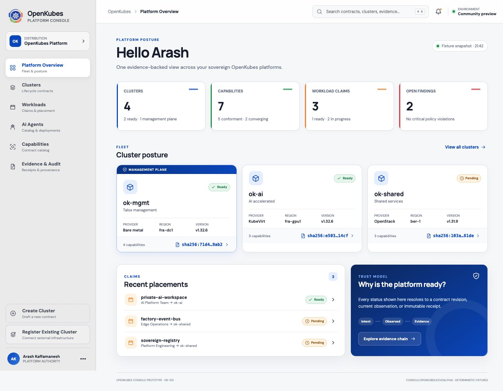

# OpenKubes Console

This repository contains the curated, frontend-only OpenKubes Platform Console
prototype from
[OK-153](https://kubernauts.atlassian.net/browse/OK-153), following the graphical
spike in OK-151 and the boundaries proposed in ADR-Platform-036. The guarded
authentication entry prototype is tracked in
[OK-154](https://kubernauts.atlassian.net/browse/OK-154) and ADR-Platform-037.

The canonical source lives at
[`openkubes/ok-console`](https://github.com/openkubes/ok-console).

> **Contracts. Clusters. Evidence.**

[](docs/images/openkubes-console-overview.jpg)

_The curated OpenKubes Platform Overview — contract-centered, evidence-first, and
designed for sovereign fleets._

## Run locally

Prerequisites: Node.js 20 or newer and pnpm 9 or newer.

```bash
git clone https://github.com/openkubes/ok-console.git
cd ok-console
pnpm install
pnpm dev
```

Open the local URL printed by Vite. The production-shaped static build is created
with:

```bash
pnpm build
pnpm preview
```

### Data adapter modes

The Console defaults to deterministic fixture mode. Copy `.env.example` to
`.env.local` and select the read-only BFF adapter for OK-159/OK-158 integration:

```bash
VITE_CONSOLE_DATA_MODE=bff
VITE_CONSOLE_BFF_URL=/api/console/v0
```

Both modes implement the same `ConsoleDataPort`. BFF responses are validated
against the Presentation Contract before mapping into view models. Credentials
remain same-origin and are never read from environment variables or browser
storage.

The OK-158 read-only BFF now runs as a separate local process. Start it in one
terminal and the BFF-backed Console in another:

```bash
pnpm start:bff
VITE_CONSOLE_DATA_MODE=bff pnpm dev
```

Vite proxies `/api/console/v0` to the local BFF. Endpoints, security boundaries,
failure injection, and production evolution are documented in
[`bff/README.md`](bff/README.md).

## Verification

The responsive acceptance record for the OK-159 Developer B slice, including
desktop, compact navigation, cluster detail, and BFF-unavailable screenshots,
lives in [`docs/evidence/ok-159`](docs/evidence/ok-159/README.md).

The evidence-backed OK-161 spike outcome is **GO** for the next curated,
read-only implementation phase—not production readiness. The decision, risks,
follow-ups and ADR disposition are recorded in
[`docs/evidence/ok-161`](docs/evidence/ok-161/README.md).

The OK-163 security work begins with a versioned, fail-closed session and
authorization contract plus an explicit
[`threat model`](docs/security/ok-163-threat-model.md). These artifacts do not
turn the graphical login simulation into production authentication.

The production session-store proposal is
[ADR-Platform-038](https://github.com/openkubes/openkubes/blob/main/architecture/decisions/ADR-Platform-038-console-session-store.md).
Its PostgreSQL reference adapter, envelope encryption and real-database
conformance suite live under `bff/security`. The runtime selects it explicitly
and never falls back to memory. The first server-side OIDC Authorization Code +
PKCE boundary uses one-time encrypted PostgreSQL flow state and an explicit
issuer-subject mapping; deployment-provider interoperability and the browser's
graphical-to-live handoff remain reviewed follow-ups.

```bash
pnpm lint
pnpm test
pnpm test:bff
pnpm test:contract
pnpm test:postgres # requires OK_CONSOLE_TEST_POSTGRES_URL
pnpm build
```

## Presentation Contract

The first read-only Console/BFF boundary is tracked by
[OK-160](https://kubernauts.atlassian.net/browse/OK-160). Its candidate
`console.openkubes.io/v0alpha1` JSON Schema, TypeScript types, runtime validation,
stable success/error examples, compatibility behavior, and redaction rules live
in [`contracts/presentation/v0alpha1`](contracts/presentation/v0alpha1).

This contract is intentionally product-oriented: the browser consumes Session,
Overview, Cluster, and Evidence-reference projections, never raw Kubernetes
resources or a generic backend proxy.

## Prototype boundaries

- Fixture-mode browser content comes from `src/data/fixtures.ts`; BFF-mode content
  comes through the controlled observed-state adapter in `bff/adapters`.
- `ConsoleDataPort` is the narrow replacement seam for a future backend adapter.
- Cluster, Capability, Workload Claim, Agent Definition, Agent Deployment, and
  Evidence v0 presentation shapes live in `src/domain/contracts.ts`.
- Create Cluster is a safe interaction prototype. It sends no request, grants no
  authority, and mutates no cluster or backend.
- Cluster Shell is a simulated diagnostic experience. It keeps cluster, namespace,
  authority, expiry, and evidence context visible, but creates no terminal process,
  WebSocket, credential, kubeconfig, or backend session. A small read-only allowlist
  returns deterministic responses; mutating commands are visibly blocked.
- AI Agents is a curated catalog and guarded placement prototype. It exposes
  capability fit, tool authority, provenance, and a reviewable
  `AgentDeploymentClaim`; only Worker Clusters are eligible and `ok-mgmt` is never
  offered as a target. The flow creates no workload, API request, or backend state.
- Register Existing Cluster is a guarded external-fleet prototype. It keeps lifecycle
  ownership external, defaults to observe-only authority, rejects browser kubeconfig
  upload, and previews a reviewable `ExternalClusterRegistration`. Discovery and
  registration are deterministic simulations and create no connector, credential,
  Secret, ProviderConfig, API request, or backend state.
- Authentication entry is an in-memory interaction prototype. OIDC is the preferred
  route and the local account path is explicitly bootstrap/break-glass only. Neither
  flow sends a request, creates a token or cookie, validates a credential, or persists
  session material in browser storage.
- Production authentication, RBAC, MFA, account recovery, live Kubernetes access,
  deployment, generic schema rendering, and AI-driven runtime adaptation are
  deliberately out of scope.

## Architecture seams

| ADR-036 concern | Prototype location |
|---|---|
| Domain/presentation shapes | `src/domain/contracts.ts` and `contracts/presentation/v0alpha1` |
| Observed state | `Cluster.lifecycle` and `Readiness` |
| Evidence projection | `EvidenceRef` and Evidence drawer |
| Presentation mapping | curated React views and design tokens |
| Compatibility | `Cluster.compatibility` and visible contract strip |
| Operation invocation | explicitly disabled Create Cluster execution preview |
| Diagnostic session | simulated Cluster Shell with read-only guardrails |
| Agent placement | simulated `AgentDeploymentClaim` with capability and authority review |
| External cluster registration | simulated `ExternalClusterRegistration` with explicit ownership and management scope |
| Authentication entry | federated-first OIDC and guarded local break-glass simulations with in-memory session state |

The supported presentation mapping is inspectable as
`console.openkubes.io/v0alpha1`. Unknown compatibility remains read-only and no UI
control is presented as a security boundary.
